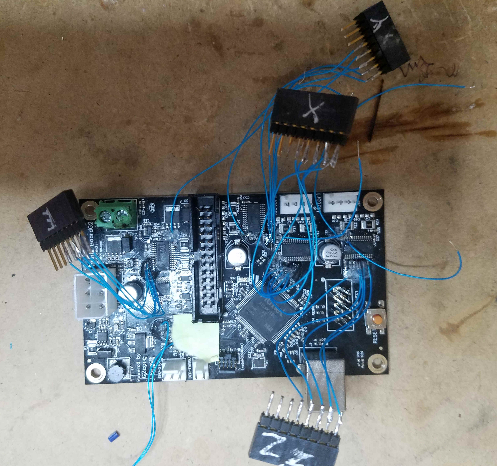

# Printrboard G2

32bit Controller - Printrbot Simple Pro

## Klipper

Just download the config file and follow the installation instructions.

https://www.klipper3d.org/Installation.html

https://github.com/KevinOConnor/klipper/issues/1121

## Stock Firmware
TinyG
https://github.com/abdrumm/printrbot-docs

## Other Firmware - No longer in devlopment 

Marlin 2.0 - Prints but some minor timing issues still exist
https://github.com/MarlinFirmware/Marlin/issues/13020

ESP3D Gui for the Printrhub Display
https://github.com/luc-github/ESP3D/issues/299

Powershell Script for Uploading Gcode locally
[PrintrBotSelfHost](https://github.com/Printrbot/PrintrBotSelfHost)

Printrbot-g2-console
https://github.com/abdrumm/printrbot-docs

*Power-Enable Bypass*

*Probing the G2 signals*

