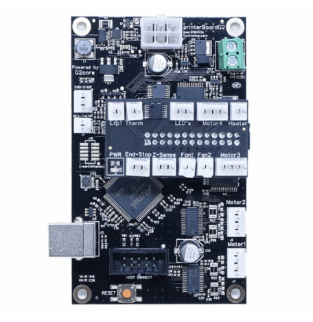
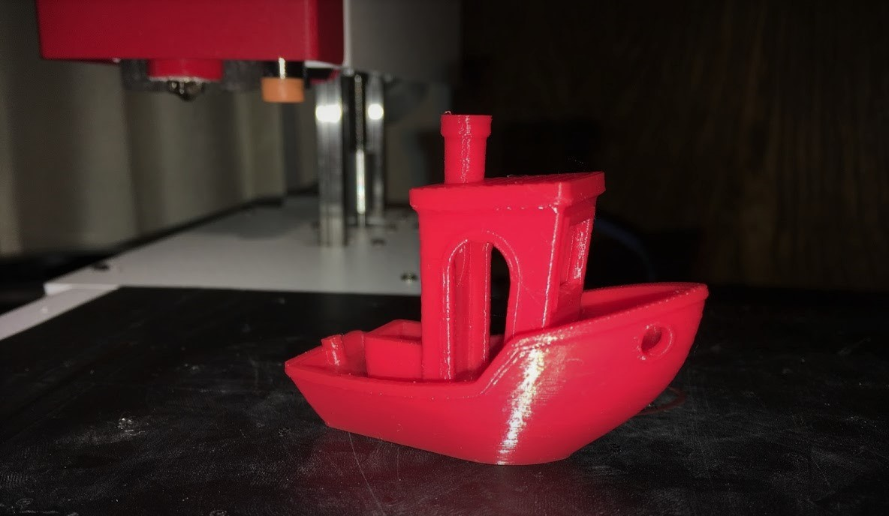

# Printrboard G2

32bit Controller - Printrbot Simple Pro

#### Klipper

* Option 1: Download the config file and follow the installation instructions. - Best Option
   Requires a Raspberry Pi 3 and Octoprint

* Option 2: Download the Raspberry Pi Octoprint image. 
   The printrboard will need to be flashed
   16Gb SD Card Required

[SD Card Image](https://docs.google.com/document/d/1a2pSCrTU5F4PQF-cdHiCjmBmUJKTg1H6sDxn2OdDtaw/edit?usp=sharing)

[Klipper Installation Guide](https://www.klipper3d.org/Installation.html)

[Klipper on G2 Github Issue for more information](https://github.com/KevinOConnor/klipper/issues/1121)

##### Steps Per MM vs Step Distance 
   The pound sign is used to comment out code
   Step distance is 1 divided by the microstepping value
   1/80 equals 0.0125 80 steps per mm at 16x microstepping
   Max velocity is around 425 mm/s, however to achieve this speed the bearings must first be run at low speed to warm up.
   [Calibration Calculator](https://vectormfg.net/support/)

#### Stock Firmware
[TinyG](https://github.com/abdrumm/printrbot-docs)

#### Other Firmware - No longer in devlopment 

[Marlin 2.0 - Prints but some setpper driver timing issues still need to be resolved](https://github.com/MarlinFirmware/Marlin/issues/13020)

[ESP3D Gui for the Printrhub Display](https://github.com/luc-github/ESP3D/issues/299)

Powershell Script for Uploading Gcode locally [PrintrBotSelfHost](https://github.com/Printrbot/PrintrBotSelfHost) 

[Printrbot-g2-console](https://github.com/abdrumm/printrbot-docs)

If you wish to remove or bypass the Printrhub
*Power-Enable Pins*
